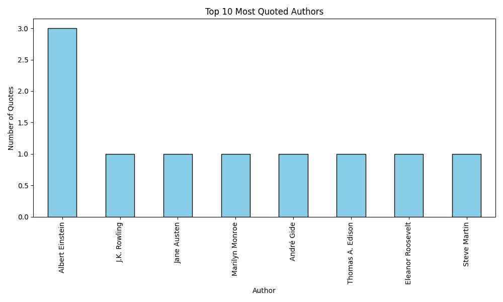

# My First Web Scraper
A Python bot that scrapes quotes from the web and saves them to a CSV file.
## Data Insights
Here is a visualization of the most quoted authors from the project:

## Technologies Used
* **Python**
* **BeautifulSoup** (for scraping)
* **Anaconda** (for environment management)